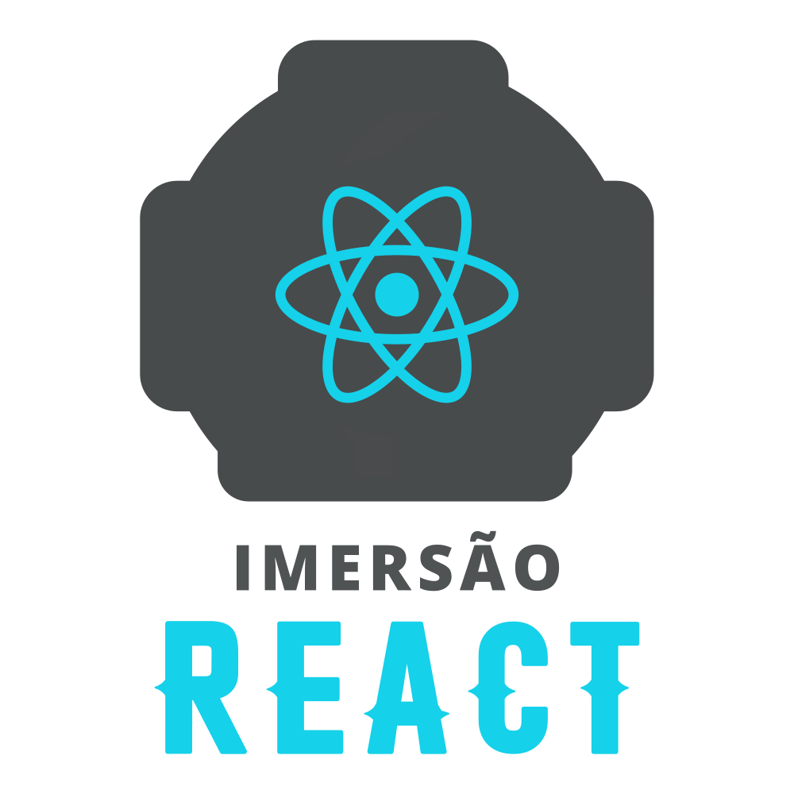

### Semana Imersão React - AluraFlix 

### O projeto Devflix foi baseado na netflix, porém, compartilhando conteúdo de tecnologia.

### Como rodar o projeto?
Após baixar o projeto, acesse ele seu terminal rode os comandos:

* npm install
* npm start

